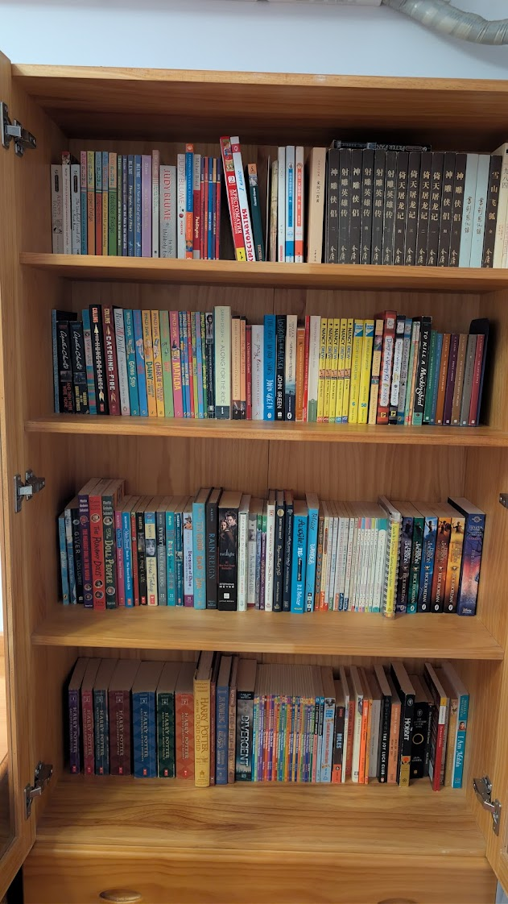

## About English Reading

- I read a lot from 2016-2021. Then I stopped reading in 2023.
- I started reading during the final year of my primary school when I transferred to SMIC International school, that was the best year in my life so far. During my middle school years, I was in a class heavily specialized in math competition with huge gender imbalance, and there weren't enough extracurricular activities. I did not have a mobile phone until just after graduation. I literally had a second childhood from reading. See this post in 2018: [My Journey in Reading](https://jimchen.me/a/65b916), it roughly started with Junie B (Autumn) -> Ready Freddy -> Magic Tree House (Winter, Spring) -> BSC/2 Narnia (Spring) -> A to Z/Nancy Drew/Martin(other novels) (Summer), then I entered middle school. I read 366 books total in 2016, then Barbara Park(other novels) -> Harry Potter -> Percy Jackson -> Other Fantasies in 2017, then Blume in 2018, then it became more diversified. I made countless visits to Shanghai foreign language bookstore, knowing each section of each floor. I frequently went on Goodreads and FantasticFiction. When I traveled to America or UK, Barnes & Nobles and Waterstones and other bookstores were my favorite spots. English books were a world I inhabited, but I was an introvert and there was no clubs in my school, nobody to discuss English books with. I did not read many hard classics though. I read far more English than Chinese. I use English primarily for my blogs and journals (over 200k words now) I use English as the primary language and think in English for many years despite living in China. When I traveled to the US, I did not feel any language barriers at all.

## My Bookshelf

- I read every book here. There are many other books in my house that I did not read, or books that I read but borrowed from a library or thrown away.

### Grid 1

- Aesop
  - Aesop's Fables
- Barrie
  - Peter Pan in Kensington Gardens and Peter and Wendy
- Baum
  - The Wonderful Wizard of Oz
- Blume
  - Fudge Series (5)
  - Going, going, gone
  - Friend or Fiend
  - Then Again, Maybe I Won't
  - It's Not the End of the World
  - Just as Long as We're Together
  - Here's to You, Rachel Robinson
  - In the Unlikely Event
  - Forever
- Bond
  - A Bear Called Paddington
  - Paddington's Guide to London
- Brown
  - Flat Stanley (4)

### Grid 2

- Chew
  - No Such Thing as a Witch
- Christie
  - And Then There Were None
- Cleary
  - Ramona's World
- Collins
  - The Hunger Games
  - Catching Fire
- Dahl
  - The Wonderful Story of Henry Sugar
  - Going Solo
  - The BFG
  - Danny the Champion of the World
  - Charlie and the Chocolate Factory
  - Boy
  - Matilda
  - The Magic Finger
  - Fantastic Mr. Fox
  - Esio Trot
  - The Twits
  - George's Marvelous Medicine
  - The Giraffe and the Pelly and Me
- Defoe
  - Robinson Crusoe
- Dessen
  - Along for the Ride
- DiCamillo
  - The Tiger Rising
  - The Miraculous Journey of Edward Tulane
- Dickens
  - A Christmas Carol
- Gilbert
  - Eat Pray Love
- Green
  - The Fault in Our Stars
  - Looking for Alaska
- Le Guin
  - The Wizard of Earthsea
- Haddon
  - The Curious Incident of the Dog in the Night-Time
- Hemingway
  - The Old Man and the Sea
  - A Farewell to Arms
- Keene
  - Nancy Drew: Girl Detective (6)
  - Nancy Drew Mystery Stories (2)
  - Nancy Drew Diaries (1)
- Kinney
  - Diary of a Wimpy Kid (7)
- Klein
  - Ready Freddy (27)\*
- Lee
  - To Kill a Mockingbird
- Lewis
  - The Chronicles of Narnia (7)

### Grid 3

- London
  - The Call of the Wild
- Lowry
  - Number the Stars
  - The Giver
- Martin
  - The Doll People (3)
  - Main Street (5)\*
  - A Dog's Life
  - On Christmas Eve
  - Here Today
  - Everything for a Dog
  - Better to Wish
  - Because of Shoe and Other Dog Stories
  - Ten Rules for Living with My Sister
  - Ten Good and Bad Things About My Life (So Far)
  - Rain Reign
- Meyer
  - Twilight (4)\*
- O'Brien
  - Mrs. Frisby and the Rats of NIMH
- Osborne
  - Magic Tree House (56)\*
  - Magic Tree House Super Edition (1)
  - Magic Tree House Merlin Missions (1)
- Palacio
  - Auggie & Me: Three Wonder Stories
  - Wonder
- Park
  - Skinnybones
  - Almost Starring Skinnybones
  - Rosie Swanson: Fourth-Grade Geek for President
  - My Mother Got Married (And Other Disasters)
  - Don't Make Me Smile
  - The Kid in the Red Jacket
  - Mick Harte Was Here
  - Junie B. Jones (26)
  - Junie B. Jones: These Puzzles Hurt My Brain!
  - Junie B.'s Essential Survival Guide to School
- Riordan
  - Percy Jackson & the Olympians (5)
  - Magnus Chase and the Gods of Asgard: The Sword of Summer
- Rodda
  - Deltora Quest

### Grid 4

- Rowling
  - Harry Potter (8)
  - Harry Potter Cinematic Guide
  - Fantastic Beasts and Where to Find Them
  - The Tales of Beedle the Bard
- Roth
  - Divergent
- Roy
  - A to Z Mysteries (26)
  - A to Z Mysteries Super Edition (20)
  - Capital Mysteries Collection
- Sachar
  - Holes
- Saint-Exupéry
  - The Little Prince
- Salinger
  - The Catcher in the Rye
- Sewell
  - Black Beauty
- Spence
  - The Spider Kingdom
- Spinelli
  - Fourth Grade Rats
- Stevenson
  - Treasure Island
- Tan
  - The Joy Luck Club
- Taylor
  - Roll of Thunder, Hear My Cry
- Tolkien
  - The Hobbit
  - The Fellowship of the Ring
- Twain
  - The Adventures of Tom Sawyer
- Warner
  - The Boxcar Children (4)\*
- White
  - Charlotte's Web
- Wilde
  - The Happy Prince and Other Stories
- Yousafzai
  - I Am Malala

### Some Other Books I Read

- Martin
  - A Corner of the Universe
  - Baby-Sitters Club 0-8
- Murray
  - Breaking Night
- Niven
  - All the Bright Places
